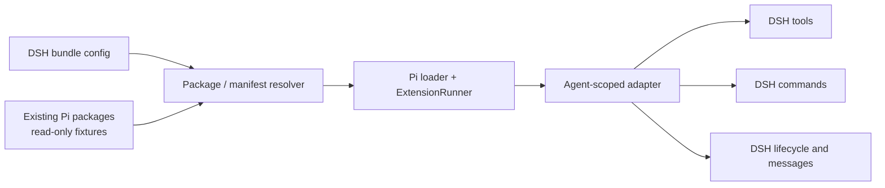

# DSH Pi

Run trusted, unmodified [Pi extensions](https://pi.dev/docs/latest/extensions) inside [DeepSeek Harness](https://github.com/deepseek-ai/deepseek-harness). This is a compatibility host, not a source-to-source converter: Pi's official loader and `ExtensionRunner` own Pi semantics, while this package adapts their observable surface to agent-scoped DSH tools, commands, messages, attachments, and lifecycle hooks.

The project currently targets Pi `0.80.x` and DSH `0.1.0-rc.6`. DSH is still a developer preview; the peer range is intentionally narrow.

## Why a host instead of generated plugins

An extension factory is executable code with lifecycle and session state. Converting its source once cannot preserve tools registered during `session_start`, mutable active-tool sets, cancellation, providers, or per-agent state. The host therefore creates one Pi runtime per DSH agent and reconciles registrations into that agent's Cordis context.



## Local development

```sh
pnpm install
pnpm check
PI_FIXTURE_WORKSPACE=/absolute/path/to/pi pnpm test
pnpm compat /absolute/path/to/pi
```

The repository at `../pi` is only read. Compatibility tests inventory its `packages/pi-*` manifests and source API usage; representative smoke tests load built entries without calling paid tools.

## Install as a DSH bundle

Install the published bundle and the Pi extensions you want in the same profile:

```sh
dsh plugin --profile demo add dsh-pi-host \
  @amaster.ai/pi-image-gen \
  @amaster.ai/pi-video-gen
dsh --profile demo --dump-config
```

For local development, replace `dsh-pi-host` with the path to this checkout, such as `./dsh-pi` when running from its parent directory.

The selected Pi packages must be installed in the same DSH profile so bare package specifiers resolve from that profile. DSH may warn that they declare no `dsh.bundle`; that is expected because they are plain dependencies loaded by `dsh-pi-host`, not independent DSH layers. Install any other package named in `extensions` the same way.

### Choose Pi extensions

Then override the bundle row in the profile's `cordis.patch.yml`. DSH replaces a row's complete `config`, so keep every field:

```yaml
- id: dsh-pi
  config:
    extensions:
      - '@amaster.ai/pi-image-gen'
      - '@amaster.ai/pi-video-gen'
    projectTrusted: false
    allowLocalPaths: false
    strict: false
    flags: {}
```

`strict: true` fails agent composition when any selected Pi tool schema cannot be represented without widening it. With `strict: false`, those tools are skipped, excluded from the Pi-visible adapted active set, and retried only after their definition changes or they are reactivated; for the current `pi-video-gen` fixture this skips `video_generate` because DSH cannot enforce its numeric `minimum`, while the other three video tools still mount.

For local fixture packages, enable the explicit code-execution boundary:

```yaml
- id: dsh-pi
  config:
    extensions:
      - '/Users/me/Workspace/pi/packages/pi-image-gen'
    projectTrusted: false
    allowLocalPaths: true
    strict: true
    flags: {}
```

`allowLocalPaths` is off by default because Pi extensions are trusted Node.js code, not sandboxed plugins. `projectTrusted` is a separate switch: it controls whether extensions may consume project-local Pi settings and policies. The host loads only entries resolved from `extensions`; it never auto-discovers `<cwd>/.pi/extensions`.

Reload the profile after changing `extensions`, then run `dsh --profile demo --dump-config` to verify the effective list.

### Configure Pi extensions

Keep Pi settings beside the DSH profile configuration and point `PI_CODING_AGENT_DIR` at that profile directory. Use Pi's established `settings.json` filename rather than a separate `pi-settings.json` compatibility format:

```text
$DSH_HOME/profiles/demo/
├── cordis.patch.yml   # selects Pi extensions
└── settings.json      # configures those Pi extensions
```

For `pi-image-gen`, the minimum configuration selects a model and keeps the API key in the environment:

```json
{
  "pi-image-gen": {
    "defaultModel": "nano-banana"
  }
}
```

```sh
export DSH_HOME="$HOME/.dsh"
export PI_CODING_AGENT_DIR="$DSH_HOME/profiles/demo"
export GEMINI_API_KEY="..."
dsh --profile demo
```

The same settings file can configure multiple selected Pi extensions under their own top-level keys. Project-local `<cwd>/.pi/settings.json` remains available only when `projectTrusted` is enabled.

## Pi API to DSH compatibility

Status:

- ✅ **Supported** — the observable Pi behavior has a DSH mapping.
- 🟡 **Partial** — useful behavior works, but some Pi semantics are missing.
- ❌ **Unsupported** — there is no faithful adapter yet; the host does not pretend it worked.

### ExtensionAPI methods

| Pi ExtensionAPI | Closest DSH capability | Implemented here | Notes |
|---|---|---:|---|
| `pi.on(...)` | Cordis `ctx.on(...)` and DSH agent/session/tool events | 🟡 Partial | See the lifecycle-event table below. |
| `pi.registerTool(...)` | `agent.ctx.tools.register(...)` | 🟡 Partial | Execution, strict schema projection (including disjoint TypeBox literal unions), `prepareArguments`, cancellation, sanitized errors, ordered updates, images, concurrency, active-tool changes and lifecycle-time registration/replacement work. Successful text is bounded to 50KB/2000 lines, oversized details are omitted, and images are checked against DSH attachment limits before decoding. Unrepresentable schemas are rejected; Pi TUI renderers and DSH live update cards do not. |
| `pi.registerCommand(...)` | `agent.ctx.commands.register(...)` | 🟡 Partial | Command handlers, sanitized unexpected failures, and `ctx.ui.notify` text work. Pi completions and interactive `ctx.ui` dialogs do not. |
| `pi.registerShortcut(...)` | No plugin-owned DSH keyboard-shortcut registry | ❌ Unsupported | Requires a separate client/UI plugin. |
| `pi.registerFlag(...)` | DSH plugin config plus the embedded Pi flag store | ✅ Supported | Defaults and configured overrides use Pi's official runner. |
| `pi.getFlag(...)` | Read the embedded Pi flag store | ✅ Supported | Preserves Pi flag lookup behavior. |
| `pi.registerMessageRenderer(...)` | DSH replayable message projections/UI plugins | ❌ Unsupported | Pi TUI components cannot be replayed as DSH render intents. |
| `pi.registerEntryRenderer(...)` | DSH session projections/UI plugins | ❌ Unsupported | Same renderer-model mismatch. |
| `pi.sendMessage(...)` | `agent.followup()`, `agent.steer()`, `agent.inject()`, `agent.send()` | 🟡 Partial | Non-waking idle injection, trigger-turn, steering, follow-up and native next-turn delivery map. Attachment persistence is drained at lifecycle boundaries and delivery is suppressed after disposal begins; durable Pi custom entries, `display`, `customType` and renderer details do not map. |
| `pi.sendUserMessage(...)` | `agent.followup()` / `agent.steer()` | ✅ Supported | Text and images map to identified DSH messages; images use DSH attachments. |
| `pi.appendEntry(...)` | Declared custom `SessionEventMap` event plus `session.append()` | 🟡 Partial | Stored in the embedded Pi session only; not yet durable in the DSH log. |
| `pi.setSessionName(...)` | DSH session-title domain/projection | 🟡 Partial | Updates Pi-side in-memory state only. |
| `pi.getSessionName()` | Read DSH title projection | 🟡 Partial | Returns the Pi-side in-memory name. |
| `pi.setLabel(...)` | Custom DSH session event/projection | 🟡 Partial | Stored in the embedded Pi session tree only. |
| `pi.exec(...)` | DSH subprocess/shell services | ✅ Supported | Uses Pi's own process runner with cwd, env, timeout and cancellation options. |
| `pi.getActiveTools()` | `ctx.tools.schemas(agent)` / scoped tool view | 🟡 Partial | Returns the filtered active set of adapted Pi tools; DSH-native tools are not included. |
| `pi.getAllTools()` | `ctx.tools.get()` / `ctx.tools.schemas()` | 🟡 Partial | Returns Pi's official extension registry, not DSH-native tools. |
| `pi.setActiveTools(...)` | Dispose/register agent-scoped DSH tool effects | 🟡 Partial | Reconciles adapted Pi registrations and ignores unknown names, but does not toggle DSH-native tools. |
| `pi.getCommands()` | `ctx.commands.list(agent)` | 🟡 Partial | Returns Pi extension commands only; DSH-native commands, skills and templates are not included. |
| `pi.setModel(...)` | DSH `Agent.options` plus an installed `LlmAdapter` | 🟡 Partial | Provider/model ids map; DSH still owns adapter availability and credentials. |
| `pi.getThinkingLevel()` | DSH request reasoning effort/header | 🟡 Partial | Pi-side state only. |
| `pi.setThinkingLevel(...)` | DSH request reasoning effort/header | 🟡 Partial | Does not yet update DSH reasoning effort. |
| `pi.registerProvider(...)` | Register a DSH `LlmAdapter` | ❌ Unsupported | Pi `ProviderConfig` is not a DSH adapter. Configure `@deepseek-ai/dsh-llm-pi-ai` separately. |
| `pi.unregisterProvider(...)` | Dispose a DSH `LlmAdapter` registration | ❌ Unsupported | The host does not own a corresponding DSH adapter. |
| `pi.events` | Cordis event bus | ✅ Supported | Pi's shared `EventBus` is supplied directly by the official Pi loader. |

### ExtensionContext and command context

| Pi context capability | Closest DSH capability | Implemented here | Notes |
|---|---|---:|---|
| `ctx.ui.*` | DSH command response and optional client UI plugins | 🟡 Partial | `/command` handlers capture `ctx.ui.notify` as response text. Dialogs and Pi TUI controls use Pi's no-op UI context. |
| `ctx.mode` | Active host transport | 🟡 Partial | Reports the embedded Pi mode (`rpc` by default), not the connected DSH frontend. |
| `ctx.hasUI` | Availability of dialog-capable UI | ✅ Supported | Correctly returns `false`; this host exposes no Pi dialogs. |
| `ctx.cwd` | `agent.session.header.cwd` | ✅ Supported | Uses the DSH agent's working directory. |
| `ctx.sessionManager` | DSH event-sourced session | 🟡 Partial | An in-memory Pi SessionManager is available, but DSH history is not projected into it. |
| `ctx.modelRegistry` | DSH LLM adapter/catalog services | 🟡 Partial | Pi provider registrations are recorded; DSH adapters, credentials and model catalog are not exposed. |
| `ctx.model` | Selected DSH provider/model | ❌ Unsupported | No Pi `Model` object is synthesized. |
| `ctx.isIdle()` | `agent.status` | ✅ Supported | Reads the DSH agent's live status. |
| `ctx.isProjectTrusted()` | `projectTrusted` config | ✅ Supported | Returns the explicit host trust decision. |
| `ctx.signal` | DSH turn/tool `AbortSignal` | ✅ Supported | Invocation-scoped and safe for parallel Pi tools. |
| `ctx.abort()` | `agent.cancel(...)` | ✅ Supported | Cancels the current DSH agent operation. |
| `ctx.hasPendingMessages()` | DSH inbox | ✅ Supported | Reads the agent inbox. |
| `ctx.shutdown()` | DSH agent cancellation/disposal | 🟡 Partial | Cancels the current agent operation; it does not exit the DSH process. |
| `ctx.getContextUsage()` | DSH usage projections | ❌ Unsupported | No Pi `ContextUsage` projection yet. |
| `ctx.compact(...)` | DSH compaction lifecycle | ❌ Unsupported | The contracts differ and no operation is invoked. |
| `ctx.getSystemPrompt()` | DSH system-prompt assembly | ❌ Unsupported | The effective assembled prompt is not exposed to Pi. |
| `ctx.getSystemPromptOptions()` | DSH assembly context | 🟡 Partial | Command contexts receive `cwd` only. |
| `ctx.waitForIdle()` | `agent.whenIdle()` | ✅ Supported | Waits for the owning DSH agent to settle. |
| `ctx.newSession()`, `ctx.fork()`, `ctx.navigateTree()`, `ctx.switchSession()` | DSH agent/session creation APIs | ❌ Unsupported | Pi's mutable session-tree operations do not map faithfully; calls fail explicitly. |
| `ctx.reload()` | Cordis/DSH plugin reload | ❌ Unsupported | DSH owns plugin reload; calls fail explicitly. |

### Lifecycle events

| Pi event | Closest DSH event/capability | Implemented here |
|---|---|---:|
| `project_trust` | Deployment/plugin trust configuration | 🟡 Configured `projectTrusted` controls `ctx.isProjectTrusted()`; the interactive handler is not run. |
| `resources_discover` | DSH skill and system-prompt registries | 🟡 Handler runs, but returned skill/prompt/theme paths are not mounted into DSH. |
| `session_start` | `agent/session-start` | ✅ Per-agent and awaited before the first step. |
| `session_shutdown` | `agent/disposed` / Cordis effect disposal | 🟡 Runs once and drains during agent or plugin teardown, but every DSH teardown is reported to Pi with reason `quit`. |
| `session_info_changed` | DSH session-title projection | ❌ Not mapped. |
| `session_before_switch`, `session_before_fork` | DSH session preparation/publication | ❌ No equivalent veto mapping yet. |
| `session_before_compact`, `session_compact` | DSH compaction plugins/events | ❌ Different compaction contract; only reload-style startup is currently emitted after compact lifecycle changes. |
| `session_before_tree`, `session_tree` | DSH event-sourced session history | ❌ Pi tree navigation has no direct DSH equivalent. |
| `input` | First `agent/pre-step` of a DSH turn | 🟡 `continue`, `handled`, and text/image transforms run once for the initial claimed DSH message batch. Text is newline-joined, images are preserved, and a transform replaces the claimed batch with one new DSH message identity. |
| `before_agent_start` | First `agent/pre-step` plus `system-prompt/assemble` | 🟡 Handler runs once per agent run; returned custom messages and system-prompt replacement are not applied yet. |
| `agent_start` | First `agent/pre-step` in a DSH turn | ✅ Emitted once per turn. |
| `agent_end` | Committed DSH `session/event: turn/end` | 🟡 Runs once after the DSH turn is durably closed, including error and cancellation paths. Text history maps; exact images, usage and tool messages are reduced. |
| `agent_settled` | Committed turn end with no pending DSH inbox messages | 🟡 Emitted after `agent_end` when no queued input remains; DSH and Pi still have different queue models. |
| `turn_start` | DSH step start | ✅ Emitted once per DSH step. |
| `turn_end` | Next DSH step / committed `turn/end` | 🟡 Paired with each emitted `turn_start`, including failed or aborted final steps; final text assistant messages map, but Pi `toolResults` are not reconstructed. |
| `context` | DSH durable request reconstruction | ❌ Mutable Pi context arrays cannot safely replace DSH durable history. |
| `message_start`, `message_update`, `message_end` | DSH session message/chunk events | ❌ No exact live-message mapping yet. |
| `tool_call` | `tools/pre-execute` / adapted tool wrapper | 🟡 Blocking works; DSH freezes arguments, so Pi handlers cannot reliably mutate them in place. |
| `tool_result` | `tools/post-execute` / adapted tool wrapper | ✅ Can replace content, details and error state before DSH conversion. |
| `tool_execution_start`, `tool_execution_end` | DSH tool execution pipeline | ✅ Paired around adapted Pi tools, including failures and cancellation. |
| `tool_execution_update` | No matching DSH tool-owned live-update callback | 🟡 Pi handlers receive and finish updates before `tool_execution_end`; DSH UI does not stream them. |
| `before_provider_request`, `before_provider_headers`, `after_provider_response` | DSH `LlmAdapter` boundary | ❌ Must be implemented inside a DSH provider adapter. |
| `model_select`, `thinking_level_select` | DSH agent/request configuration | ❌ No selection-event mapping yet. |
| `user_bash` | DSH shell tool policy/events | ❌ DSH does not expose Pi's user-bash interception contract. |

The host additionally provides Pi package-manifest discovery, dynamic extension selection through DSH config, one official Pi runtime per DSH agent, HMR-safe effect disposal, and invocation-scoped cancellation for parallel tools.

See [the detailed compatibility matrix](./docs/compatibility.md) and the executable source of truth in [`src/capabilities.ts`](./src/capabilities.ts).

## Publishing

Git installs need pnpm permission to run this package's `prepare` build. The npm package ships prebuilt `lib/` and needs no install-time build permission. Maintainers publish by pushing a tag that exactly matches the package version, for example `v0.1.0-rc.2`; the release workflow validates, builds, tests, and publishes `dsh-pi-host` with the repository's `NPM_TOKEN` secret. Prereleases use npm's `next` tag and stable versions use `latest`.
